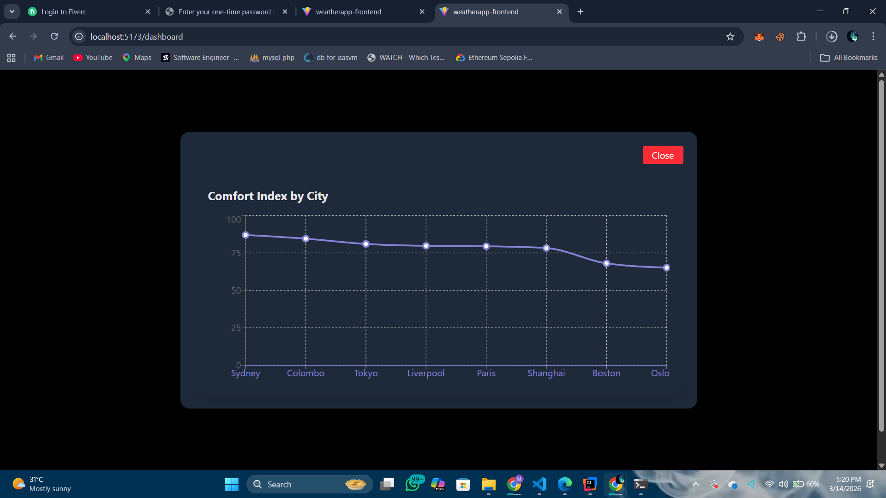
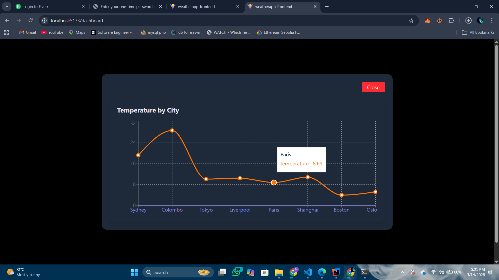

# Weather App

A full-stack weather analytics application that fetches real-time weather data, calculates a Comfort Index Score, and visualizes results using charts.

The system combines temperature, humidity, and wind speed to estimate how comfortable the weather feels for a user.

## Features

- Uses Auth0 for authentication and Authorization
- Uses real time weather APIs to show exact weather based on the city
- Has two graph views that depicts how the comfort score and temperature differs between cities
- Has light and dark themes


## 1. Setup Instructions

_Prerequisites_

Weather-app requires [Node.js](https://nodejs.org/) v18+ to run.
Weather-app requires [Java](https://www.oracle.com/java/technologies/javase/jdk21-archive-downloads.html) 21 to run.

_Other_
Maven
Git

_Backend Setup (Spring Boot)_

Clone the repository

```sh
git clone https://github.com/hadhi419/weather-app.git
cd weather-app/backend
```

Configure API key

```sh
weather.api.key=YOUR_OPENWEATHER_API_KEY
```

Run the backend

```sh
mvn spring-boot:run
```

Backend runs on:

```sh
http://localhost:8080
```

_Frontend Setup (React+vite)_

Navigate to frontend folder

```sh
cd frontend
```

Install dependencies

```sh
npm install
```

Run the frontend

```sh
npm run dev
```

Frontend runs on:

```sh
http://localhost:5173
```

## 2. Comfort Index Formula

The Comfort Index Score estimates how comfortable the weather feels based on environmental factors.

Three parameters are used:

-Temperature
-Humidity
-Wind Speed

_Backend Setup (Spring Boot)_

Formula

```sh
Comfort Index = 
(Temperature Score × 0.5) +
(Humidity Score × 0.3) +
(Wind Speed Score × 0.2)
```

Each parameter is normalized into a 0–100 scale before calculating the final score.

Example
```sh
Temperature = 28°C
Humidity = 60%
Wind Speed = 4 m/s
```

The algorithm converts these into scores and produces a final Comfort Index between 0 and 100.


## 3. Reasoning Behind Variable Weights

Different weather factors influence human comfort differently.

##### Temperature (Weight = 0.5)

Temperature has the largest impact on human comfort, as extreme heat or cold immediately affects how people feel.
Therefore, it is given the highest weight.

##### Humidity (Weight = 0.3)

Humidity affects how the body perceives temperature.
High humidity makes temperatures feel hotter because sweat evaporates more slowly.
Thus humidity is given a moderate weight.

##### Wind Speed (Weight = 0.2)

Wind can improve comfort by cooling the body, especially in warm weather.
However, its impact is generally less significant compared to temperature and humidity.
Therefore it receives the lowest weight.


## 4. Trade-offs Considered

Several design decisions required balancing complexity and performance.

##### Simplicity vs Accuracy

A full weather comfort model could include many parameters such as:
-pressure
-UV index
-cloud coverage
-dew point
However, including too many variables increases complexity.

To keep the system simple and easy to understand, the model uses three primary variables.

##### Real-time API Calls vs Performance

Weather APIs can be slow or rate-limited.
Making frequent API calls for every request would reduce performance.
To solve this, a caching mechanism is used.

##### Data Normalization

Weather parameters use different units (°C, %, m/s).
They are normalized into a common scoring scale (0–100) before calculating the final index.
This simplifies calculations but slightly reduces precision.


# 5. Cache Design Explanation

To reduce external API calls and improve performance, a server-side cache is implemented using Caffeine, a high-performance Java caching library.

### How it Works

When a user requests weather data for a city, the system first checks the cache.
If cached data exists and is less than 5 minutes old, it is returned directly.
Otherwise, the system fetches data from the weather API and stores it in the cache for future requests.

### Cache Benefits

Reduces the number of API calls, saving bandwidth and avoiding rate limits.
Improves response time by serving cached results instantly.
Handles temporary API failures gracefully, since recent data is available in the cache.

### Cache Duration

Weather data is cached for 5 minutes, which balances freshness and performance.
This duration ensures that the weather information is reasonably up-to-date while minimizing API calls.

# 6. Known Limitations
Despite working well, the system has some limitations.
### Simplified Comfort Model
The Comfort Index is a simplified estimation and does not fully represent human thermal comfort.
More advanced models (like Heat Index or UTCI) would provide better accuracy.

### API Dependency
The system depends on a third-party weather API.
If the API is unavailable or rate-limited, the application may fail to fetch new data.

### Regional Variations

Comfort perception varies depending on climate and personal tolerance.
The current formula does not adjust for regional climate differences.

# Weather App

A full-stack weather analytics application that fetches real-time weather data, calculates a Comfort Index Score, and visualizes results using charts.

The system combines temperature, humidity, and wind speed to estimate how comfortable the weather feels for a user.

## Features

- Uses Auth0 for authentication and Authorization
- Uses real time weather APIs to show exact weather based on the city
- Has two graph views that depicts how the comfort score and temperature differs between cities
- Has light and dark themes


## 1. Setup Instructions

_Prerequisites_

Weather-app requires [Node.js](https://nodejs.org/) v18+ to run.
Weather-app requires [Java](https://www.oracle.com/java/technologies/javase/jdk21-archive-downloads.html) 21 to run.

_Other_
Maven
Git

_Backend Setup (Spring Boot)_

Clone the repository

```sh
git clone https://github.com/hadhi419/weather-app.git
cd weather-app/backend
```

Configure API key

```sh
weather.api.key=YOUR_OPENWEATHER_API_KEY
```

Run the backend

```sh
mvn spring-boot:run
```

Backend runs on:

```sh
http://localhost:8080
```

_Frontend Setup (React+vite)_

Navigate to frontend folder

```sh
cd frontend
```

Install dependencies

```sh
npm install
```

Run the frontend

```sh
npm run dev
```

Frontend runs on:

```sh
http://localhost:5173
```

## 2. Comfort Index Formula

The Comfort Index Score estimates how comfortable the weather feels based on environmental factors.

Three parameters are used:

-Temperature
-Humidity
-Wind Speed

_Backend Setup (Spring Boot)_

Formula

```sh
Comfort Index = 
(Temperature Score × 0.5) +
(Humidity Score × 0.3) +
(Wind Speed Score × 0.2)
```

Each parameter is normalized into a 0–100 scale before calculating the final score.

Example
```sh
Temperature = 28°C
Humidity = 60%
Wind Speed = 4 m/s
```

The algorithm converts these into scores and produces a final Comfort Index between 0 and 100.


## 3. Reasoning Behind Variable Weights

Different weather factors influence human comfort differently.

##### Temperature (Weight = 0.5)

Temperature has the largest impact on human comfort, as extreme heat or cold immediately affects how people feel.
Therefore, it is given the highest weight.

##### Humidity (Weight = 0.3)

Humidity affects how the body perceives temperature.
High humidity makes temperatures feel hotter because sweat evaporates more slowly.
Thus humidity is given a moderate weight.

##### Wind Speed (Weight = 0.2)

Wind can improve comfort by cooling the body, especially in warm weather.
However, its impact is generally less significant compared to temperature and humidity.
Therefore it receives the lowest weight.


## 4. Trade-offs Considered

Several design decisions required balancing complexity and performance.

##### Simplicity vs Accuracy

A full weather comfort model could include many parameters such as:
-pressure
-UV index
-cloud coverage
-dew point
However, including too many variables increases complexity.

To keep the system simple and easy to understand, the model uses three primary variables.

##### Real-time API Calls vs Performance

Weather APIs can be slow or rate-limited.
Making frequent API calls for every request would reduce performance.
To solve this, a caching mechanism is used.

##### Data Normalization

Weather parameters use different units (°C, %, m/s).
They are normalized into a common scoring scale (0–100) before calculating the final index.
This simplifies calculations but slightly reduces precision.


# 5. Cache Design Explanation

To reduce external API calls and improve performance, a server-side cache is implemented using Caffeine, a high-performance Java caching library.

### How it Works

When a user requests weather data for a city, the system first checks the cache.
If cached data exists and is less than 5 minutes old, it is returned directly.
Otherwise, the system fetches data from the weather API and stores it in the cache for future requests.

### Cache Benefits

Reduces the number of API calls, saving bandwidth and avoiding rate limits.
Improves response time by serving cached results instantly.
Handles temporary API failures gracefully, since recent data is available in the cache.

### Cache Duration

Weather data is cached for 5 minutes, which balances freshness and performance.
This duration ensures that the weather information is reasonably up-to-date while minimizing API calls.

# 6. Known Limitations
Despite working well, the system has some limitations.
### Simplified Comfort Model
The Comfort Index is a simplified estimation and does not fully represent human thermal comfort.
More advanced models (like Heat Index or UTCI) would provide better accuracy.

### API Dependency
The system depends on a third-party weather API.
If the API is unavailable or rate-limited, the application may fail to fetch new data.

### Regional Variations

Comfort perception varies depending on climate and personal tolerance.
The current formula does not adjust for regional climate differences.

# Screenshots





